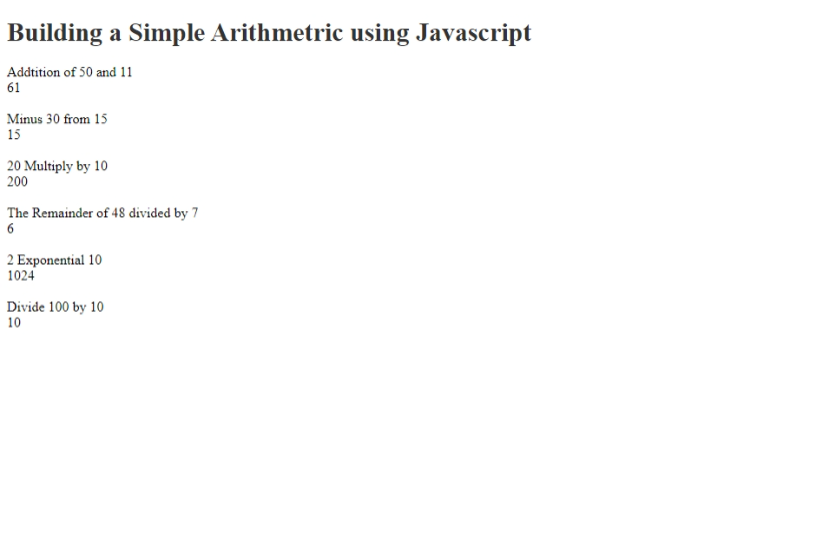

## Table of contents

- [Table of contents](#table-of-contents)
- [Overview](#overview)
  - [Screenshot](#screenshot)
  - [Links](#links)
- [My process](#my-process)
  - [Built with](#built-with)
  - [What I learned](#what-i-learned)
- [Author](#author)

## Overview

### Screenshot

### Links

- Solution URL: [Add solution URL here](https://your-solution-url.com)
- Live Site URL: [Add live site URL here](https://your-live-site-url.com)

## My process

### Built with

- Semantic HTML5 markup
- CSS custom properties
- Javascript
- CSS 
- Mobile-first workflow

### What I learned

I'm starting to learn about javascript and how to use HTML and CSS with Javascript. 

## Author
Markup:
  - Website - [Gabriel Rachael Omowumi](https://www.instagram.rachy_word1.com)
  - Frontend Mentor - [@rachy112](https://www.frontendmentor.io/profile/rachy112)
  - Twitter - [@rachyworld](https://www.twitter.com/rachy112)
